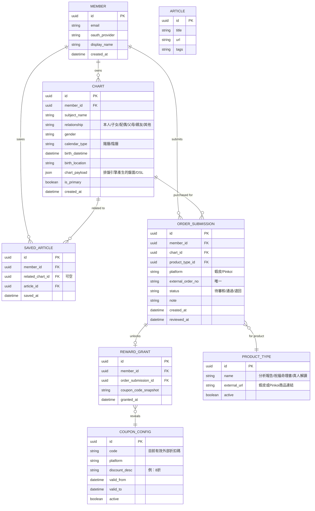

# 親紫之間｜會員系統 需求規格（v1）

> 用途：本文件為「會員系統」的需求規格，可直接放進現有專案，作為交給 AI（如 Claude Code）逐步建構的依據。
> 設計核心原則：**以「命盤」為中心實體**，會員只是容器；所有資料（關係、收藏、購買、產品）都掛在命盤上。新增產品＝在命盤底下多接一種類型，不動整體架構。

---

## 1. 問題與目標

### 問題陳述
前台已有免費排盤程式，瀏覽者輸入生辰即可產生命盤，但目前無處留存、無法管理多張命盤、也無法回流促成購買。需要一個會員系統，讓使用者把命盤留下來、管理自己與親友的命盤，並透過「驗證消費換折扣券」的循環帶動回購與口碑擴散。

### 目標
1. 讓使用者註冊後能保存並管理多張命盤（本人＋親友）。
2. 以命盤為入口，導流到蝦皮／Pinkoi 完成購買（站外金流）。
3. 用「輸入訂單號 → 審核 → 發折扣券（可轉送）」建立低成本的回購／推薦循環。
4. 架構上預留「以命盤為核心擴充不同產品」的能力。

### 非目標（v1 明確排除）
- **站內金流**：不做站內付款，購買一律導向蝦皮／Pinkoi。
- **自動串接蝦皮／Pinkoi 訂單 API**：初版不自動抓訂單，訂單號由會員手動輸入。
- **自動驗證訂單號真偽**：v1 由你人工審核。
- **站內折扣計算**：折扣由平台 voucher 機制負責，本系統不計算金額。
- **命盤分析內容生成**：由既有的分析 pipeline 負責，本系統只儲存與顯示其產出。

---

## 2. 角色

| 角色 | 說明 |
| --- | --- |
| 會員（自助端） | 登入後管理自己與親友的命盤、收藏文章、登錄訂單、領折扣碼。 |
| 管理者（你，審核端） | 審核會員提交的訂單號、設定目前有效的折扣碼、維護產品與其外部連結。 |

---

## 3. 資料模型

中心是「命盤（Chart）」。出生資料是其來源；關係、收藏文章、訂單登錄都掛在命盤上；折扣券是「訂單審核通過後解鎖一組外部折扣碼」的紀錄。

設計註記：
- 「關係」用 CHART.relationship 一個欄位表達即可（命盤對「本人」的關係），不另開資料表。
- 「出生資料」概念上是命盤的來源，欄位直接放在 CHART；保留 birth 欄位與 chart_payload 分離，未來引擎升級可重算盤面。
- chart_payload 由 polaris-ziwei-engine 產生，本系統只儲存與顯示。

---

## 4. 會員端功能（頁面）

整體視覺參考 Google 帳戶首頁：左側導覽 + 卡片 + 上方搜尋。**視覺是最後一層皮，先把資料與流程做對。**

1. **註冊／登入**：email 註冊或第三方 OAuth（Google 等）。承接前台排盤：訪客在前台排完盤 → 引導加入會員 → 入會後該盤自動存入其帳號。
2. **首頁（我的命盤）**：以卡片列出所有命盤（本人＋親友），可搜尋／點入。
3. **命盤詳情**：單張命盤為一個工作區，含盤面、關係標註、相關／收藏文章、此盤的購買記錄、以及「為這張盤下單」入口。
4. **命盤管理**：新增／編輯／刪除命盤，標註與本人的關係。
5. **訂單登錄與折扣碼**：輸入在蝦皮／Pinkoi 完成消費的訂單號 → 提交審核 → 通過後顯示可使用（並可轉送）的折扣碼。
6. **帳戶設定**：email、第三方登入、刪除帳號（對應 Google 的「個人資訊／安全性」）。

---

## 5. 管理端功能（你的審核台）

1. **待審訂單佇列**：列出所有「待審核」的訂單號提交，可看會員、平台、產品、訂單號，按「通過／退回」。
2. **發券**：訂單通過時，自動為該會員建立一筆 REWARD_GRANT，內容＝目前 COUPON_CONFIG 的折扣碼快照（顯示給會員）。
3. **折扣碼設定（COUPON_CONFIG）**：可隨時更新「目前有效折扣碼」、平台、折扣說明、效期。（因蝦皮規定同一折扣代碼需在該券結束 30 天後才能重設，這裡採可更新的設定值而非寫死。）
4. **產品維護（PRODUCT_TYPE）**：維護各產品名稱與其蝦皮／Pinkoi 商品連結。

---

## 6. 下單與折扣流程

關鍵設計：**站內不處理金流、不計算折扣**。真正的折扣由平台 voucher 機制負責，本系統只負責「驗證消費並解鎖一組平台既有折扣碼」。

1. 會員在命盤詳情按「下單某產品」→ 系統依 PRODUCT_TYPE.external_url 導向蝦皮／Pinkoi。
2. 會員在平台完成購買。
3. 會員回系統，於該命盤底下登錄訂單號（ORDER_SUBMISSION，status＝待審核）。
4. 你在審核台核對 → 通過。
5. 系統建立 REWARD_GRANT，顯示目前有效折扣碼給會員。
6. 折扣碼可轉送，任何人下次在平台結帳輸入即享折扣（每人限用一次、總量上限由平台控管）。

**折扣機制（決策：採 A 全開放，已捨棄 B 一人一碼）**
- 在蝦皮後台建**一組共用折扣碼**（如「賣場折扣券」或「商品折扣券」），設定折扣額度、最低消費、效期、**數量上限**。系統只儲存／顯示這組碼，不自行產生唯一碼。
- 蝦皮的「每位買家限用一次」是綁**使用的帳號**，不是綁碼；因此同一組碼可被許多不同帳號各用一次——這正是「可轉送、任何人都能用」的預期行為。
- **總量控制旋鈕＝蝦皮的「折扣券數量」上限**。用完自動下架，你再決定是否開新碼（注意蝦皮 30 天重設限制，見第 5 節）。
- **接受外流**：碼一旦公開散佈，未登錄訂單的人也能用。此為刻意取捨，視為免費觸及。因此「登錄訂單才解鎖」在本模式下的作用是「觸發點＋蒐集誰買了的資料」，而非真正的權限門。

---

## 7. 防濫用規則（預設值，你可改）

採 A 全開放後，「折扣總量」主要靠平台的折扣券數量上限把關（見第 6 節），本系統的規則偏向資料正確與發券紀錄一致：

- ORDER_SUBMISSION.external_order_no 在同一平台內**唯一**：避免同一訂單號重複登錄、重複留下發券紀錄。
- 每筆「通過」的訂單只對應一次發券（REWARD_GRANT 對 ORDER_SUBMISSION 一對一）。
- 折扣碼效期、每帳號限用一次、總量上限 → 交給蝦皮 voucher 設定把關。
- 退回的訂單需附原因（note），會員可修正後重送。

---

## 8. 技術假設與介接

- 建立在**現有專案**上（既有 Flask 服務）。
- 命盤產生：呼叫 **polaris-ziwei-engine**（Flask API／MCP）取得 chart_payload。
- 認證：email + 第三方 OAuth。
- 無金流、無蝦皮／Pinkoi 訂單 API 介接。
- 文章來源待定（見開放問題）。

---

## 9. 需求優先級

### P0（不做不能上線）
- [ ] 註冊／登入（email + OAuth），承接前台排盤入會
- [ ] 命盤 CRUD + 關係標註 + 串接排盤引擎產生盤面
- [ ] 首頁命盤卡片列表、命盤詳情頁
- [ ] 訂單號登錄、管理端審核台、COUPON_CONFIG、通過後顯示折扣碼

### P1（快速跟進）
- [ ] 收藏文章（與命盤關聯）
- [ ] Google 風視覺皮（左側導覽 + 卡片 + 搜尋）
- [ ] 退回原因與重送流程

### P2（架構預留，不在 v1 建）
- [ ] 以命盤為核心擴充更多產品類型
- [ ] 真人預約解讀的站內預約流程
- [ ] 自動驗證訂單號／串接平台 API

---

## 10. 開放問題（需你拍板）

- **Pinkoi 折扣碼**：請在你的設計館後台確認，是否能自訂「任意人結帳時輸入」的折扣碼（蝦皮確定可以）。若不行，Pinkoi 端的回饋可能要改用關注券／P Coins，或主推蝦皮做此循環。
- **文章來源**：收藏的「相關文章」來自哪裡？自建 CMS、Outline、還是外部部落格連結？
- **真人預約解讀**：v1 是否只導外部，還是要站內預約？（建議 v1 只導外部，列 P2。）
- **訂單號格式**：蝦皮與 Pinkoi 訂單號格式不同，是否要在登錄時做基本格式檢查。

---

## 11. 建議開發順序

1. 認證 + 會員／命盤 CRUD + 串接排盤引擎（系統骨架）
2. 首頁卡片 + 命盤詳情頁（含關係、購買、文章區塊外框）
3. 訂單號登錄 + 管理端審核台 + COUPON_CONFIG + 發券顯示（核心商業循環）
4. 收藏文章
5. 套上 Google 風視覺
