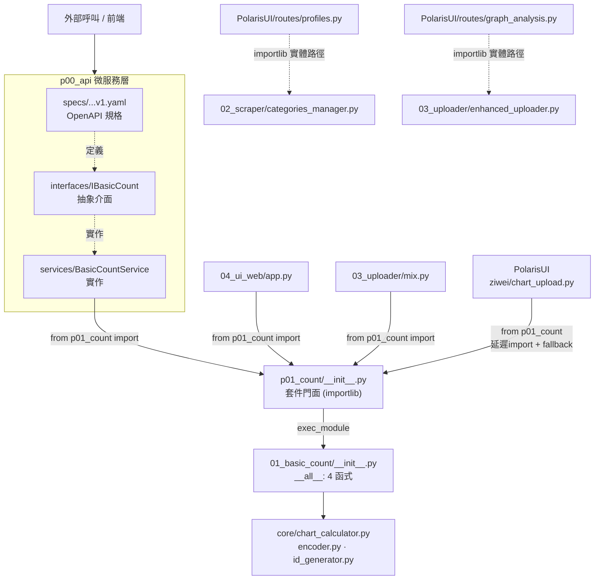

# 01_basic_count 依賴關係圖

本文件說明 `01_basic_count` 模組目前被哪些程式、以何種方式調用。

> 因資料夾名稱以數字開頭，Python 無法直接 `import`。所有調用都收斂到上層
> `p01_count/__init__.py` 門面（用 `importlib` 動態載入），再對外導出 4 個公開函式。

---

## ASCII 依賴圖

```
                        外部呼叫 / 前端
                              │
                              ▼
          ┌───────────────────────────────────────┐
          │   p00_api  (微服務化 REST 層)          │
          │  ┌─────────────────────────────────┐  │
          │  │ specs/p01_01_basic_count_v1.yaml│  │  ← OpenAPI 規格
          │  │ interfaces/...interface.py      │  │  ← IBasicCount 抽象介面
          │  │ services/...service.py          │  │  ← BasicCountService 實作
          │  └──────────────┬──────────────────┘  │
          └─────────────────┼─────────────────────┘
                            │ from p01_count import calculate_chart …
   ┌────────────────────────┼────────────────────────────┐
   │                        │                            │
P_Union 內部              PolarisUI 後端                同 repo 工具
   │                        │                            │
   ▼                        ▼                            ▼
04_ui_web/app.py    backend/modules/ziwei/        03_uploader/mix.py
                      logic/chart_input/             (排盤+上傳)
                      chart_upload.py
 (sys.path.insert     (from p01_count, 延遲import
  + from p01_count)    + ImportError fallback)
   │                        │                            │
   └────────────┬───────────┴──────────────┬────────────┘
                │                          │
                ▼                          ▼
   ╔══════════════════════════╗   importlib 直接檔案載入
   ║  p01_count/__init__.py    ║   (繞過 p01_count，指實體路徑)
   ║  ── 套件門面 ──           ║      │
   ║  importlib 動態載入       ║      ├─ profiles.py → 02_scraper/categories_manager.py
   ║  數字開頭資料夾，         ║      └─ graph_analysis.py → 03_uploader/enhanced_uploader.py
   ║  重新導出 4 個函式        ║
   ╚════════════╤═════════════╝
                │ exec_module("01_basic_count/__init__.py")
                ▼
   ┌──────────────────────────────────────────────┐
   │  01_basic_count/__init__.py   (__all__ 公開)  │
   │     calculate_chart                            │
   │     calculate_batch_charts                     │
   │     encode_chart_data                          │
   │     generate_chart_id                          │
   └───────────────────┬────────────────────────────┘
                       ▼
   ┌──────────────────────────────────────────────┐
   │  01_basic_count/core/                          │
   │    chart_calculator.py   (calculate_chart …)   │
   │    encoder.py / encoder_flow.py                │
   │    id_generator.py                             │
   └──────────────────────────────────────────────┘
```

---

## Mermaid 版



---

## 調用方式總表

| 方式 | 調用方 | 寫法 |
|------|--------|------|
| 套件 import（主要） | p00_api service、04_ui_web、03_uploader、PolarisUI ziwei | `from p01_count import calculate_chart` |
| REST 微服務 | 外部 / API 層 | OpenAPI `p01_01_basic_count_v1.yaml` |
| importlib 檔案路徑載入 | PolarisUI routes（profiles / graph_analysis） | `spec_from_file_location(...)`（主要用於 02/03 子模組，非 core） |

## 公開介面（`__all__`）

- `calculate_chart` — 單一命盤計算
- `calculate_batch_charts` — 批次命盤計算
- `encode_chart_data` — 本命盤編碼
- `generate_chart_id` — 生成命盤 ID

（`p01_count/__init__.py` 門面僅再導出前述 4 個函式中的
`calculate_chart` / `calculate_batch_charts` / `encode_chart_data` / `generate_chart_id`。）

## 重點

- **唯一正規入口**：所有計算需求收斂到 `p01_count/__init__.py` 門面 → `exec_module` 載入
  `01_basic_count/__init__.py` 公開函式 → 落到 `core/`。
- **`p00_api` 為最正式的對外層**：規格(yaml) → 介面(interface) → 實作(service) 三層。
- **兩種調用風格並存**：
  - 實線 = `from p01_count import …`（乾淨套件 import，走門面）。
  - 虛線 = `importlib.spec_from_file_location(...)` 直接指實體檔案路徑（只用來拿 02/03
    的工具檔，未經 p01_count 門面，是耦合到實體目錄結構的脆弱點）。

---

_產生日期：2026-05-29_
